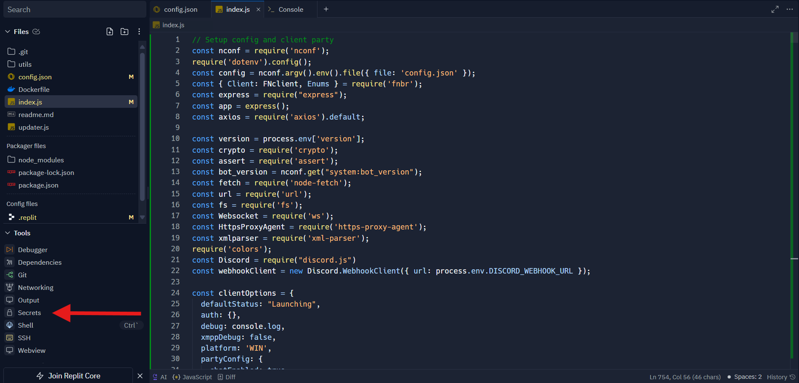
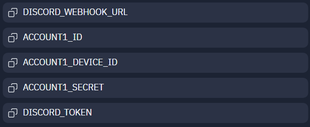

Este es un bot para Fortnite pensado para ser ejecutado en [Replit](https://replit.com/), pero támbien funciona en local. A continuación, explico como utilizarlo:

## Instalación
- Entra en [Replit](https://replit.com/) e inicia sesión (o crea una cuenta si no tienes una)
 
- Haz clic en "Import from Github"
 
  
 
- En la ventana que aparece, selecciona "From URL", pega el link de este repositorio y haz clic en "Import from Github"

  

- Una vez estés dentro, abre la pestaña "Secrets" en el apartado "Tools"

  
  
- Añade los siguientes secretos:

  
  
  Entra [aquí](assets/docs/secrets.md) para saber que poner en cada uno

- ¡Y eso sería todo! También puedes entrar en el archivo config.json para cambiar cosas como la skin del bot, el estado...
